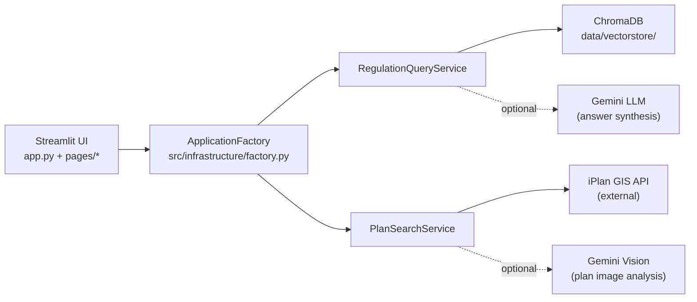

# GISArchAgent

Streamlit web app + CLI tools for exploring Israeli planning data (iPlan) and querying planning regulations with a local vector database.

Built for architecture workflows: map-based browsing, plan analysis, and reproducible data management.

**Quick links:** [Run guide](./docs/RUN_GUIDE.md) · [Vector DB build](./docs/BUILD_VECTORDB_GUIDE.md) · [Scripts/CLI](./scripts/README.md) · [Docs index](./docs/README.md) · [Tests](./tests/README.md) · [Contributing](./CONTRIBUTING.md) · [License](./LICENSE)

## What It Does

- **Web UI (Streamlit)** with three pages:
  - Map viewer: `./pages/1_📍_Map_Viewer.py`
  - Plan analyzer: `./pages/2_📐_Plan_Analyzer.py`
  - Data management: `./pages/3_💾_Data_Management.py`
- **Local vector DB (ChromaDB)** for semantic search over “regulations” (auto-initializes on first run).
- **DataStore + CLI** for inspecting/searching/exporting iPlan plan metadata stored as JSON.
- Optional **Gemini-powered** answer synthesis (LLM) and plan image analysis (vision) when `GEMINI_API_KEY` is set.

> [!NOTE]
> This repo is structured around a local-first workflow: most state lives under `./data/` and is ignored by git (see `./.gitignore`).

## Quickstart

### Prerequisites

- Python **3.10+** (tests enforce this via `./pytest.ini`)
- (Optional, for live iPlan ingestion) Local Chrome installed for the CDP-based fetcher (`pydoll-python`)
- (Optional) Gemini API key for LLM synthesis and vision: `GEMINI_API_KEY`

### Setup + Run

```bash
# One-shot setup (creates ./venv, installs deps, creates .env, initializes data dirs)
./setup.sh

# Run the web app
./run_webapp.sh

# Or directly:
# source venv/bin/activate
# streamlit run app.py
```

Open http://localhost:8501

## Usage

### Web App

Start with:

```bash
streamlit run app.py
```

Then use:

- **Query Assistant** (main page sidebar) for regulation search and Q&A.
- **📍 Map Viewer** for browsing plan geometries and basic GIS filters.
- **📐 Plan Analyzer** for building-rights calculations and uploads (vision requires `GEMINI_API_KEY`).
- **💾 Data Management** for DataStore + vector DB status and maintenance.

### CLI

DataStore (plans JSON):

```bash
# View stats for the local DataStore JSON (data/raw/iplan_layers.json)
python3 scripts/data_cli.py status -v

# Search by city (Hebrew works)
python3 scripts/data_cli.py search --city "ירושלים"

# Export a filtered subset
python3 scripts/data_cli.py export out/plans_jerusalem.json --city "ירושלים" --pretty
```

Vector DB builder (unified pipeline):

```bash
# Quick status for the vector DB persistence at data/vectorstore/
python3 scripts/quick_status.py

# Build/update the vector DB (example: process up to 10 plans; skip vision)
python3 scripts/build_vectordb_cli.py build --max-plans 10 --no-vision

# Same CLI via wrapper:
python3 build_vectordb.py build --max-plans 10 --no-vision
```

> [!IMPORTANT]
> The vector DB auto-initializes with bundled sample regulations from `./src/vectorstore/data_sources.py`. For larger or fresher datasets, use the build pipeline (`./scripts/build_vectordb_cli.py`).

### Python API

Minimal “regulation query” path:

```python
from src.infrastructure.factory import get_factory
from src.application.dtos import RegulationQuery

factory = get_factory()
service = factory.get_regulation_query_service()

result = service.query(RegulationQuery(query_text="parking requirements", max_results=5))
print(result.answer)
for reg in result.regulations:
    print("-", reg.title)
```

Plan search path (vision only runs when `GEMINI_API_KEY` is set):

```python
from src.infrastructure.factory import get_factory
from src.application.dtos import PlanSearchQuery

factory = get_factory()
service = factory.get_plan_search_service()

res = service.search_plans(PlanSearchQuery(location="תל אביב", max_results=3))
for p in res.plans:
    print(p.plan.name)
```

## Configuration

Settings are loaded from `./.env` (created by `./setup.sh`) via `./src/config.py`.

| Variable | Used for | Required |
|---|---|---|
| `GEMINI_API_KEY` | Gemini LLM synthesis + vision analysis (factory uses it for `GeminiLLMService` and `GeminiVisionService`) | Optional |
| `GOOGLE_API_KEY` | Fallback key for Gemini (used if `GEMINI_API_KEY` is unset) | Optional |
| `OPENAI_API_KEY` / `ANTHROPIC_API_KEY` | Present in settings, but this repo’s factory currently wires Gemini for synthesis | Optional |

## How It Works (At a Glance)



## Project Layout

- `./app.py`: main Streamlit entrypoint
- `./pages/`: Streamlit pages (map viewer, plan analyzer, data management)
- `./src/`: clean-architecture layers (domain/application/infrastructure/vectorstore)
- `./scripts/`: CLI utilities (`data_cli.py`, `build_vectordb_cli.py`, helpers)
- `./docs/`: design + runbooks (start at `./docs/README.md`)
- `./data/`: local cache, raw JSON, and vectorstore persistence (gitignored)

## Testing

This repo uses `pytest` with markers (see `./pytest.ini` and `./tests/README.md`):

```bash
# Install dev dependencies (pytest, ruff, black)
./venv/bin/pip install -r requirements-dev.txt

# Full suite
./venv/bin/python -m pytest

# Unit-only
./venv/bin/python -m pytest -m unit
```

## Deep Dive

<details>
<summary>More docs and operational guides</summary>

- Start here for the vector DB pipeline: `./docs/BUILD_VECTORDB_GUIDE.md`
- End-to-end run + manual testing checklist: `./docs/RUN_GUIDE.md`
- DataStore + JSON layout and CLI details: `./docs/DATA_MANAGEMENT.md`
- Vector DB health checks and thresholds: `./docs/VECTOR_DB_VALIDATION.md`
- Architecture notes: `./docs/ARCHITECTURE.md` and `./docs/HOW_IT_WORKS.md`

</details>

## Contributing and License

- Contribution process: `./CONTRIBUTING.md`
- License: `./LICENSE`
