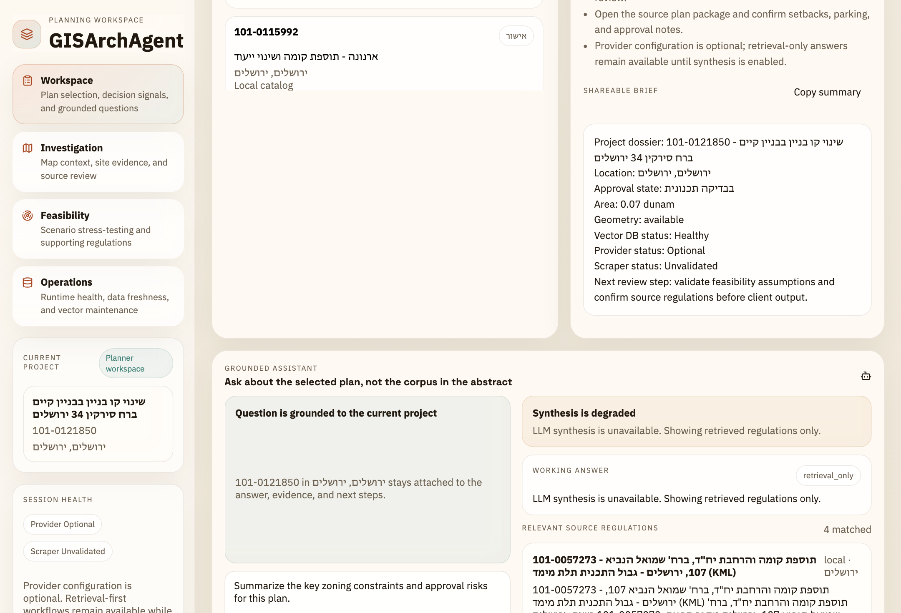
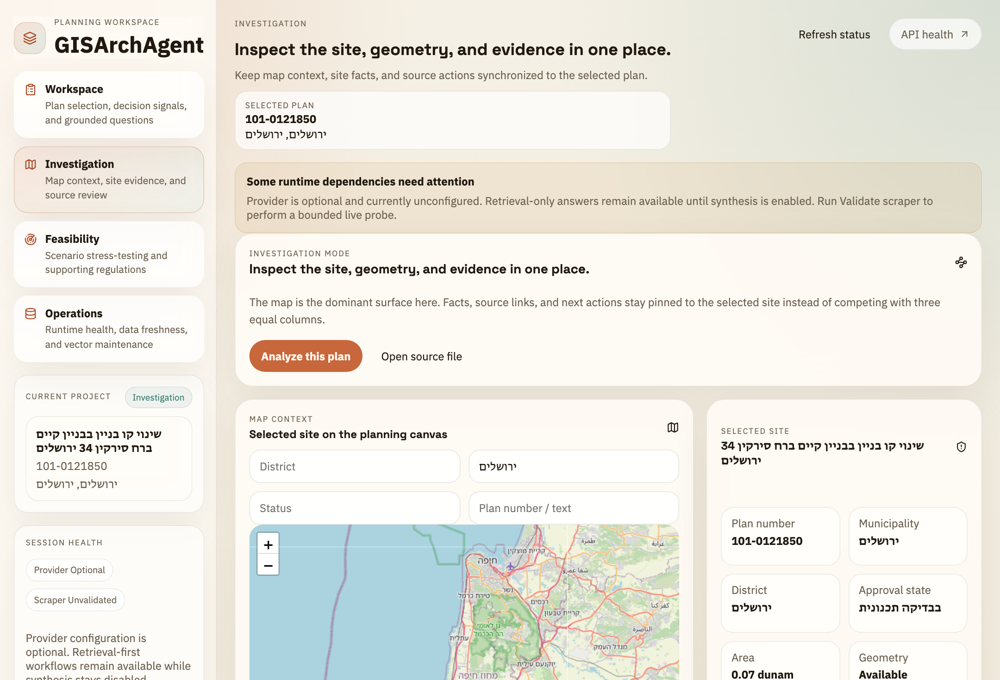
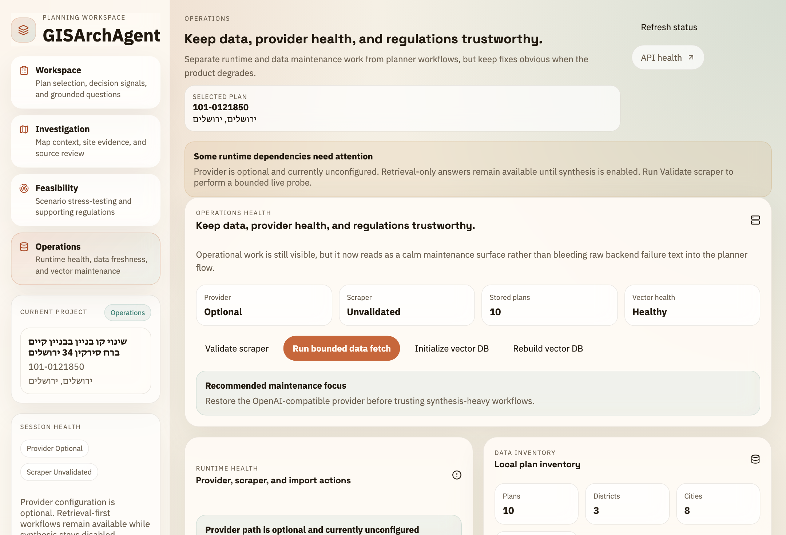

# GISArchAgent

GISArchAgent is a local-first planning workspace for architecture teams that need Israeli plan search, regulation retrieval, site context, and early feasibility checks in one flow.

Quick Links: [Quickstart](./docs/getting_started/quickstart.md) / [Run Guide](./docs/RUN_GUIDE.md) / [Docs Index](./docs/INDEX.md) / [Problem Framing](./docs/explanation/problem_landscape_and_solution.md) / [CLI Reference](./docs/reference/cli.md) / [Contributing](./CONTRIBUTING.md)

> [!NOTE]
> Maintained product path: `FastAPI + React`. The legacy Streamlit UI is not part of the supported runtime.

## Why It Lands

- One current project stays selected across workspace, map, feasibility, and operations views.
- Retrieval-first regulation answers remain available even when no OpenAI-compatible provider is configured.
- Data refresh, scraper checks, and vector maintenance stay local, visible, and scriptable.

## Product



Workspace keeps plan selection, decision signals, grounded Q&A, and a shareable brief in one screen.

| Investigation | Operations |
| --- | --- |
|  |  |
| Map context and site evidence stay tied to the selected plan. | Runtime health, data freshness, and vector maintenance stay visible without leaking backend noise into planner flows. |

## Quickstart

```bash
./setup.sh
./run_webapp.sh
```

Open [http://127.0.0.1:5173](http://127.0.0.1:5173). The launcher starts FastAPI and Vite together, resolves occupied default ports automatically, and points the frontend at the backend it actually started.

<details>
<summary>Optional provider configuration</summary>

Add these to `.env` only if you want synthesis or upload analysis:

```bash
OPENAI_BASE_URL=http://127.0.0.1:8080/v1
OPENAI_API_KEY=your-key-if-needed
OPENAI_MODEL=gpt-4o-mini
OPENAI_VISION_MODEL=gpt-4o-mini
```

If `OPENAI_BASE_URL` is unset, the product stays usable in retrieval-only mode and marks vision features as unavailable instead of pretending they work.

</details>

## Core Workflows

- `/`: search local plans, select the active project, and ask grounded regulation questions.
- `/map`: inspect geometry, source links, and site context around the selected plan.
- `/analyzer`: compare a proposal against heuristic building rights and review uploads when vision is configured.
- `/data`: validate the scraper, run bounded refreshes, import data, and maintain the vector database.

## Verification

```bash
./venv/bin/python -m pytest tests/integration/api/test_fastapi_endpoints.py -q
cd frontend && npm run build
cd frontend && npm run test:e2e
```

For deeper runbooks, configuration, and architecture notes, start with [docs/INDEX.md](./docs/INDEX.md) and [docs/RUN_GUIDE.md](./docs/RUN_GUIDE.md).

> [!IMPORTANT]
> TODO: add a committed `LICENSE` file so repository usage terms are explicit.
