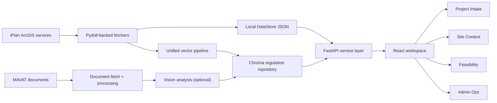
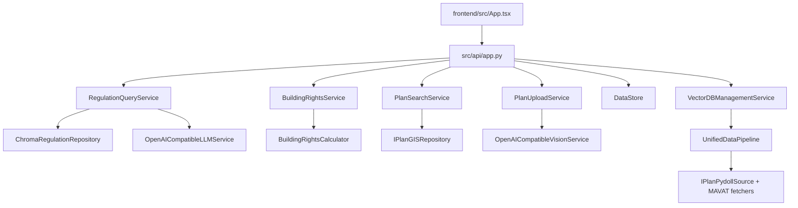

# GISArchAgent: Problem Landscape, Core Ideas, and How This Repository Solves It

## TL;DR

- **Problem**: architecture teams need to combine planning geometry, plan metadata, regulations, and proposal assumptions to answer one practical question: "Can we do this on this site, and what is likely to block us?"
- **Why it is hard**: the evidence is fragmented across GIS endpoints, planning portals, text-heavy documents, and unstable upstream systems.
- **What this repo does**: it builds a local-first planning workspace with retrieval-backed regulation answers, map-centric plan review, bounded scraping, heuristic feasibility checks, and optional OpenAI-compatible synthesis/vision.
- **What to understand after this page**: where the product sits in the planning-tech landscape, why the architecture looks the way it does, and how the code maps onto those design choices.

## 1. The Problem Landscape

This repository lives in the gap between GIS tooling, document retrieval, and early architectural feasibility work.

In practice, a project architect or planner usually needs to answer questions like:

- Which plan applies to this site?
- What district, status, and planning context does it sit in?
- What do the retrieved regulations actually say?
- Does a rough proposal fit likely height, coverage, or floor-area constraints?
- Is the source system healthy enough to trust a fresh scrape today?

Those questions are awkward because the data is distributed across different technical shapes:

- **Spatial records** from iPlan/ArcGIS-style services
- **Portal workflows and attachments** from MAVAT-like web interfaces
- **Regulation text** that benefits from semantic retrieval
- **Proposal assumptions** that are easiest to reason about as explicit numeric inputs

Common failure modes in this space are predictable:

- a map view knows where the plan is, but not what the regulations say
- a regulation query sounds good, but is detached from the selected site
- an LLM invents certainty when retrieval was weak
- a scraper fails quietly because the upstream site changed or a WAF intervened
- a feasibility calculator looks authoritative even though it is really using local heuristics

Typical solution families split into a few camps:

1. **Pure GIS viewers**: good at layers and geometry, weak at regulation reasoning.
2. **Document search systems**: good at retrieval, weak at map context and site workflow.
3. **Statutory engines**: powerful when the encoded rule set is complete, expensive and brittle when it is not.
4. **General chat wrappers**: convenient, but often ungrounded and hard to audit.

GISArchAgent sits in the middle on purpose. It is a **local-first due-diligence workspace** that favors evidence retrieval, explicit runtime health, and practical feasibility estimates over a pretense of full legal automation.

## 2. What This Library Believes / Optimizes For

The design philosophy is visible in the code:

- **Evidence before eloquence**: retrieve regulations first, then synthesize only if the provider is healthy.
- **Local-first operation**: local JSON data, local Chroma persistence, and bounded external calls make the system inspectable and testable.
- **Truthful degradation**: the app exposes provider and scraper health instead of returning polished nonsense.
- **Useful heuristics beat fake precision**: building-rights calculations are intentionally simple and explicit.
- **Practical operator ergonomics matter**: there is a dedicated admin surface for fetcher validation, data import, and vector maintenance.

What the repo is *not* trying to do:

- be a complete statutory interpreter for every planning regime
- hide upstream instability
- replace human planning judgment
- guarantee that every live scrape succeeds

## 3. The Core Solution in Plain Language

GISArchAgent treats architectural due diligence as a pipeline:

1. Keep a local store of plan features that can be searched quickly.
2. Keep a local vector index of regulations and planning text for semantic lookup.
3. Let the user select a site or plan and keep that project context persistent.
4. Use that context to ground regulation queries and feasibility checks.
5. When available, use an OpenAI-compatible provider for answer synthesis and upload analysis.
6. When the provider or scraper is unhealthy, say so explicitly and keep the deterministic parts working.

This is why the product feels half GIS tool, half retrieval system, and half admin console. Real planning work is annoyingly fractional like that.

## 4. System / Pipeline Overview

The key architectural move is the split between:

- **deterministic local state**: DataStore, Chroma, cached files
- **bounded external boundaries**: iPlan, MAVAT, OpenAI-compatible provider

That split lets the app stay useful even when an external dependency is unhealthy.

## 5. From Concept to Code

### Responsibility map

### Main concepts and their code homes

#### API boundary

`src/api/app.py` exposes the current product shape:

- `/api/health` and `/api/system/status` report provider, scraping, vector, cache, and data-store state
- `/api/regulations/query` drives grounded regulation lookup
- `/api/building-rights/calculate` drives feasibility heuristics
- `/api/uploads/analyze` runs upload analysis when vision is available
- `/api/data/*` and `/api/vectordb/*` support operator workflows

This file is the cleanest place to see what the product actually is today.

#### Application services

`src/application/services/` contains the use cases:

- `regulation_query_service.py`: retrieve regulations, optionally synthesize an answer, and report truthful `answer_status`
- `building_rights_service.py`: compute heuristic rights and attach applicable regulations
- `plan_search_service.py`: orchestrate live plan search and optional vision/caching behavior
- `plan_upload_service.py`: analyze uploaded plans and return structured findings

The important thing here is that the services are **workflow-oriented**, not framework-oriented.

#### Domain heuristics

`src/domain/value_objects/building_rights.py` contains `BuildingRights` and `BuildingRightsCalculator`.

This is not a full statutory reasoner. It encodes practical zone-based heuristics such as `R1`, `R2`, `R3`, `C1`, and `TAMA35`, then derives:

- max coverage
- floor area ratio
- max building area
- max floors and height
- open-space requirement
- parking estimate

#### Local data store

`src/data_management/data_store.py` manages the local JSON-backed plan store:

- load and normalize plan payloads
- search by district, city, status, and text
- expose statistics for the UI and CLI
- support local import without depending on the live network

This gives the app a stable local backbone for map browsing and project selection.

#### Vector retrieval and ingestion

`src/vectorstore/unified_pipeline.py` is the large ingestion story:

- discover plans from iPlan through the Pydoll-backed source
- fetch plan documents from MAVAT
- optionally run vision analysis
- extract and upsert regulations into Chroma

The repo uses this to turn external planning material into a searchable local corpus.

#### Wiring and provider policy

`src/infrastructure/factory.py` is the dependency seam:

- creates repositories and services lazily
- auto-initializes the vector DB when needed
- exposes provider status
- instantiates the OpenAI-compatible text and vision adapters

This is where the repo makes its "provider optional, retrieval mandatory" stance concrete.

#### Frontend workflow shell

`frontend/src/App.tsx` is the current product face:

- `/` project intake and dossier
- `/map` site context
- `/analyzer` feasibility and upload analysis
- `/data` admin and runtime validation

The React shell carries the persistent current-plan context so the workflows feel connected instead of page-local.

## 6. Mathematical / Algorithmic Foundations

This repo is light on formal mathematics, but a few equations help explain the implementation.

### 6.1 Retrieval intuition

Semantic search usually works by embedding text into vectors and ranking nearby items in that embedding space. Conceptually:

$$
\text{score}(q, d) = \cos(\mathbf{e}_q, \mathbf{e}_d)
$$

Where:

- $\mathbf{e}_q$ is the embedding of the user query
- $\mathbf{e}_d$ is the embedding of a stored regulation or planning text chunk

Higher cosine similarity means the retrieved document is more semantically related to the query.

In this repo, that idea appears in the Chroma-backed regulation repository and the vector-management flows. The precise embedding backend is configurable, but the product behavior is the familiar retrieval pattern: find semantically nearby regulations, then optionally synthesize an answer from them.

### 6.2 Feasibility heuristics

The building-rights logic is intentionally simple and explicit. The core derived values in `BuildingRightsCalculator` are:

$$
\text{max\_building\_area} = \text{plot\_size} \times \text{FAR}
$$

$$
\text{max\_coverage} = \text{plot\_size} \times \frac{\text{coverage\_percent}}{100}
$$

$$
\text{open\_space} = \text{plot\_size} - \text{max\_coverage}
$$

These are good early-stage planning heuristics because they are easy to audit and compare against a proposed scenario. They are **not** a substitute for a full encoded planning code.

### 6.3 Bounded external computation

The scraper and provider logic are not mathematically complex, but they are algorithmically important:

- provider probing checks whether `OPENAI_BASE_URL` is actually serving a JSON OpenAI-compatible endpoint
- fetcher validation runs bounded probes and reports explicit status
- degraded states are surfaced rather than silently folded into empty success responses

That policy is an algorithmic choice too: prefer explicit failure classification over optimistic ambiguity.

## 7. Related Work and Relevant Papers

### Suggested reading order

1. Lewis et al. for the retrieval-plus-generation framing
2. Karpukhin et al. for dense retrieval intuition
3. Esri Feature Service docs for the GIS boundary this repo consumes
4. Chroma docs for the collection/query model used locally
5. OpenAI Chat API docs for the provider contract the adapters target

### References

- **Retrieval-Augmented Generation for Knowledge-Intensive NLP Tasks**  
  [https://arxiv.org/abs/2005.11401](https://arxiv.org/abs/2005.11401)  
  Canonical RAG framing: retrieve evidence first, then generate. GISArchAgent does not implement the paper literally, but its regulation-query flow follows the same high-level pattern.

- **Dense Passage Retrieval for Open-Domain Question Answering**  
  [https://arxiv.org/abs/2004.04906](https://arxiv.org/abs/2004.04906)  
  A strong foundation for understanding why dense vector retrieval works better than plain keyword matching in many question-answering settings. Relevant for the regulation search layer.

- **Esri Feature Service Reference**  
  [https://developers.arcgis.com/rest/services-reference/enterprise/feature-service/](https://developers.arcgis.com/rest/services-reference/enterprise/feature-service/)  
  Useful for understanding the external GIS/feature-service payload model that iPlan-family integrations resemble.

- **Chroma Query and Get**  
  [https://docs.trychroma.com/docs/querying-collections/query-and-get](https://docs.trychroma.com/docs/querying-collections/query-and-get)  
  Explains the collection-query model behind the local regulation repository.

- **Chroma Embedding Functions**  
  [https://docs.trychroma.com/docs/embeddings/embedding-functions](https://docs.trychroma.com/docs/embeddings/embedding-functions)  
  Helps connect repository-level retrieval behavior to the underlying embedding setup.

- **OpenAI Chat Completions API Reference**  
  [https://platform.openai.com/docs/api-reference/chat/v1](https://platform.openai.com/docs/api-reference/chat/v1)  
  Relevant because the current text and vision adapters target an OpenAI-compatible protocol. In this repo, that contract is used for local MockChat-style providers as well.

## 8. End-to-End Mental Model

Imagine a project architect opening the app for a new site review:

1. They go to **Project Intake** and search the local plan store.
2. They select a plan, which becomes the current project context across the app.
3. The dossier summarizes plan identity, location, and current system state.
4. They ask a grounded question about zoning constraints.
5. The regulation query service retrieves likely relevant regulations from the vector store.
6. If the provider is healthy, the app synthesizes an answer from those results. If not, it returns retrieval-only output with an explicit warning.
7. They move to **Site Context** to inspect geometry and location filters.
8. They move to **Feasibility** and enter project assumptions like plot size, zone, floors, or parking.
9. The building-rights service computes heuristic allowances and compares them to the proposal.
10. If they upload a plan image or document, the upload service attempts vision-assisted analysis through the configured OpenAI-compatible endpoint.
11. If data needs attention, they go to **Admin Ops** to validate fetchers, run a bounded scrape, inspect vector status, or import local JSON.

That is the product’s core mental model: **project context first, evidence-backed reasoning second, runtime honesty always**.

## 9. When This Approach Works Well / When It Doesn't

### Works well when

- you want a local, inspectable planning workspace
- you need fast iteration on plan selection, regulation lookup, and rough feasibility
- you want deterministic workflows even when external dependencies are flaky
- you are comfortable with heuristics for early-stage analysis

### Works less well when

- you need a full statutory reasoning engine
- you need guaranteed live scraping against changing upstream portals
- you need provider-backed synthesis or vision, but the configured endpoint is not actually OpenAI-compatible
- you need a final legal/planning opinion rather than an engineerable due-diligence tool

## 10. Practical Reading Guide for the Codebase

Recommended reading order:

1. [`README.md`](../../README.md)
2. [`docs/explanation/problem_landscape_and_solution.md`](./problem_landscape_and_solution.md)
3. [`src/api/app.py`](../../src/api/app.py)
4. [`src/application/services/`](../../src/application/services)
5. [`src/domain/value_objects/building_rights.py`](../../src/domain/value_objects/building_rights.py)
6. [`src/vectorstore/unified_pipeline.py`](../../src/vectorstore/unified_pipeline.py)
7. [`frontend/src/App.tsx`](../../frontend/src/App.tsx)
8. [`tests/integration/api/test_fastapi_endpoints.py`](../../tests/integration/api/test_fastapi_endpoints.py)
9. [`frontend/tests/app.spec.ts`](../../frontend/tests/app.spec.ts)

If you are new to the repo, start with the API boundary and tests before the larger ingestion pipeline. The pipeline is important, but it is not the easiest first read.

## 11. Glossary

- **Due diligence**: early project-stage investigation of what a site or plan likely allows, restricts, or risks.
- **DataStore**: the local JSON-backed store of plan features used by the map and project-selection flows.
- **Vector DB**: the local Chroma-backed regulation index used for semantic retrieval.
- **RAG**: retrieval-augmented generation, where retrieval supplies grounded context before a model answers.
- **FAR**: floor area ratio, the total allowed floor area relative to plot size.
- **Coverage**: the portion of the plot footprint that may be built on.
- **MAVAT**: the planning-portal side of document and attachment access in this repo’s scraping flows.
- **Pydoll fetcher**: the browser-backed fetch path used because direct API access can be unstable or WAF-constrained.
- **Degraded mode**: a truthful partial-function state where the app keeps deterministic workflows alive but reports missing external capability.

## 12. Further Exploration

- [Docs index](../INDEX.md)
- [Feature audit](../FEATURE_AUDIT.md)
- [CLI reference](../reference/cli.md)
- [Run end-to-end guide](../how_to/run_end_to_end.md)
- [Architecture explanation](./architecture.md)
- [Vector pipeline deep dive](../UNIFIED_PIPELINE.md)

## Notes on Current Local Defaults

Two important truths are worth repeating:

- The local default `OPENAI_BASE_URL` in `src/config.py` points to `http://127.0.0.1:8080/v1`. If that address serves a web UI instead of a JSON API, synthesis and vision will degrade by design.
- Scraping is bounded and validated, not guaranteed. That is a deliberate product choice because upstream planning portals change and occasionally misbehave.
